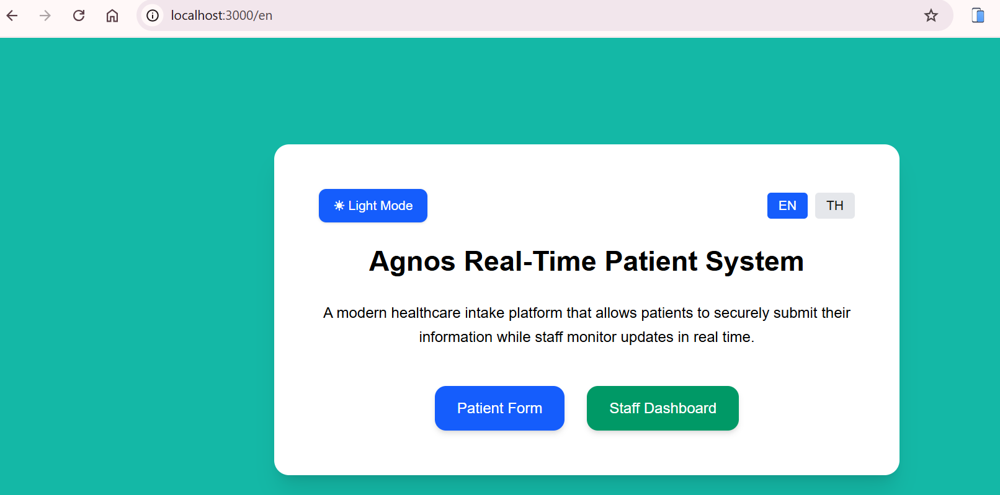
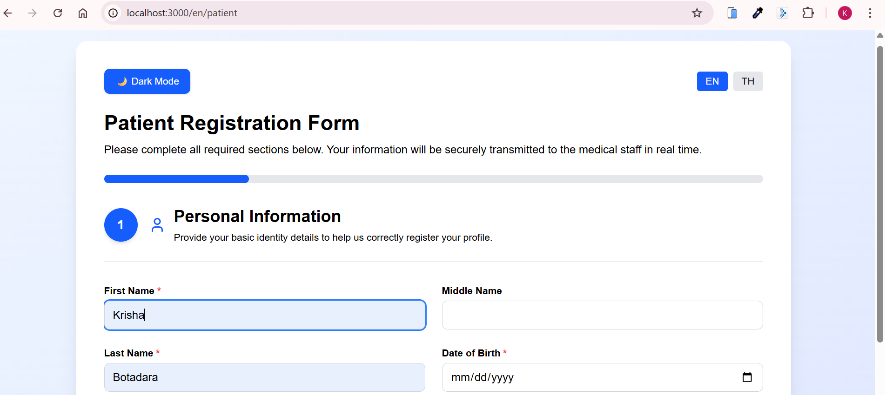
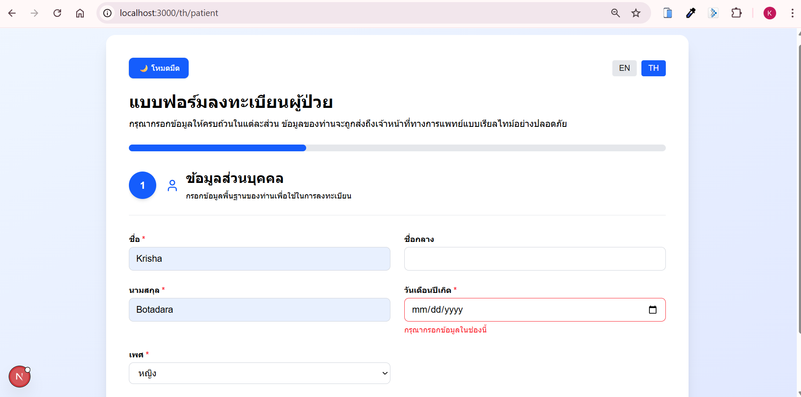
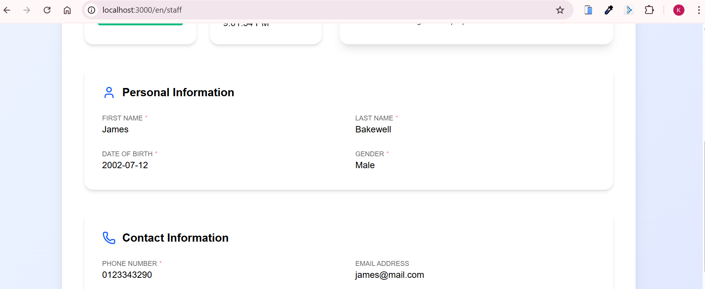

# 🏥 Real-Time Patient Registration & Staff Monitoring System

A modern, responsive hospital intake system built with **Next.js (App Router)**, **Supabase Realtime**, and **AI-powered medical summary generation**.

This project was developed as part of the **Agnos Frontend Developer Candidate Assignment**, requiring a real-time synchronized patient form and staff monitoring dashboard deployed to a cloud platform.

---

# 📌 Assignment Context

The objective was to:

* Build a **Patient Form** for entering registration details
* Build a **Staff Dashboard** to monitor patient input in real-time
* Synchronize both interfaces instantly
* Ensure full responsiveness across mobile and desktop
* Deploy the project to a cloud platform

This repository contains the complete working solution.

---

# 🚀 Overview

This system enables:

* Live patient form submission
* Real-time staff monitoring using Supabase Realtime
* Required-field completion tracking
* Submission status indicators (Active / Inactive / Submitted)
* AI-generated professional intake summaries
* Multi-language support (English 🇺🇸 / Thai 🇹🇭)
* Clean, scalable, production-ready architecture

---

# 🧠 Core Features

## 👩‍⚕️ Patient Interface

* Responsive multi-section registration form
* Required vs optional field validation
* Real-time database updates while typing
* Live submission status feedback
* Mobile-first optimized layout
* English / Thai language toggle

### Fields Included

* First Name
* Middle Name (optional)
* Last Name
* Date of Birth
* Gender
* Phone Number
* Email
* Address
* Preferred Language
* Nationality
* Emergency Contact (optional)
* Religion (optional)

---

## 🖥️ Staff Dashboard

* Live patient monitoring via **Supabase Realtime subscriptions**
* Field-by-field instant updates from database changes
* Completion percentage based on required fields only
* Submission timestamp with full format:

> Example: 20 November 2025, 7:54:01 PM

* Activity status indicators:

  * 🟢 Actively filling
  * 🟡 Inactive
  * 🔵 Submitted

* AI-generated summary

* Smooth animated progress tracking

---

## 🌍 Internationalization

* Implemented using `next-intl`
* English 🇺🇸
* Thai 🇹🇭
* Dynamic UI re-render on language change
* Translated field labels
* Locale-aware timestamps

---

## 🤖 AI Integration

* Secure server-side AI summary generation
* Uses Groq LLM API
* Produces concise, professional paragraph-style intake notes
* No hallucinated data — strictly based on provided form fields
* Handles missing emergency contact gracefully

---

# 🏗️ Tech Stack

| Technology           | Purpose                           |
| -------------------- | --------------------------------- |
| Next.js (App Router) | Frontend + API routes             |
| TypeScript           | Type safety                       |
| Supabase             | Database + Realtime subscriptions |
| PostgreSQL           | Persistent patient storage        |
| Tailwind CSS         | Styling                           |
| Framer Motion        | UI animations                     |
| next-intl            | Internationalization              |
| Groq API (LLM)       | AI summary generation             |
| Lucide Icons         | UI icons                          |

---

# 🔄 Real-Time Synchronization Architecture

Instead of WebSockets, this system uses **Supabase Realtime powered by PostgreSQL logical replication.**

### Flow:

1️⃣ Patient types into form
2️⃣ Form updates are saved to Supabase database
3️⃣ Supabase triggers real-time change event
4️⃣ Staff dashboard listens via `channel().on('postgres_changes')`
5️⃣ Staff UI updates instantly without refresh
6️⃣ Completion recalculates based only on required fields
7️⃣ Staff can trigger AI summary generation via API route
8️⃣ Server returns structured paragraph summary

This approach is:

* Production-safe on Vercel
* Serverless compatible
* Automatically scalable
* Persistent (data stored in database)

---

# 🗄️ Database Schema (Supabase)

### Table: `patients`

| Column             | Type               |
| ------------------ | ------------------ |
| id                 | uuid (primary key) |
| first_name         | text               |
| middle_name        | text               |
| last_name          | text               |
| date_of_birth      | date               |
| gender             | text               |
| phone              | text               |
| email              | text               |
| address            | text               |
| preferred_language | text               |
| nationality        | text               |
| emergency_contact  | text               |
| religion           | text               |
| status             | text               |
| updated_at         | timestamp          |

Realtime is enabled on this table for live subscriptions.

---

# 📂 Project Structure

```
app/
 ├── [locale]/
 │    ├── patient/
 │    ├── staff/
 │
 ├── api/
 │    └── generate-summary/
 │         └── route.ts

components/
 ├── control-buttons.tsx
 ├── info-card.tsx
 ├── input-field.tsx
 ├── patient-form.tsx
 ├── patient-section.tsx
 ├── section-header.tsx
 ├── select-field.tsx
 ├── staff-dashboard.tsx
 ├── status-indicator.tsx

context/
 └── theme-context.tsx

hooks/
 └── use-inactivity.ts

lib/
 └── supabase.ts

i18n/
 └── request.ts

messages/
 ├── en.json
 └── th.json

utils/
 ├── helper-functions.ts
 └── validation.ts

types/
 └── patient.ts
```

---

# ⚙️ Installation & Setup

## 1️⃣ Clone Repository

```bash
git clone https://github.com/Krisha1703/agnos-realtime-form.git
cd agnos-realtime-form
```

---

## 2️⃣ Install Dependencies

```bash
npm install
```

---

## 3️⃣ Supabase Setup

1. Create project at:
   [https://supabase.com](https://supabase.com)

2. Create a `patients` table

3. Enable **Realtime** for the table

4. Go to:

Settings → API

Copy:

* Project URL
* anon public key

---

## 4️⃣ Environment Variables

Create:

```
.env.local
```

Add:

```
NEXT_PUBLIC_SUPABASE_URL=your_project_url
NEXT_PUBLIC_SUPABASE_ANON_KEY=your_anon_key
GROQ_API_KEY=your_groq_api_key
```

Restart the development server after adding environment variables.

---

## 5️⃣ Run Development Server

```bash
npm run dev
```

Visit:

```
http://localhost:3000
```

---

# 🌐 Deployment

Deployed on: **Vercel**
https://agnos-realtime-form.vercel.app

---

# 📸 Demo

## 👩‍⚕️ Home Page



## 👩‍⚕️ Patient Form




## 🖥️ Staff Dashboard




---

# 🎨 Design Decisions

* Clean hospital-oriented UI
* Clear section grouping:

  * Personal Information
  * Contact Information
  * Background & Emergency
* Minimal distraction for staff monitoring
* Responsive grid layout
* Professional spacing and typography
* Database-first architecture instead of temporary socket state

---

# 📊 Evaluation Criteria Alignment

| Requirement    | Implementation                         |
| -------------- | -------------------------------------- |
| Responsiveness | Fully responsive (mobile & desktop)    |
| Code Quality   | Modular, scalable, TypeScript-based    |
| Real-Time Sync | Supabase Realtime (Postgres changes)   |
| Persistence    | Stored in PostgreSQL                   |
| UX/UI          | Clean, intuitive hospital-style design |
| Deployment     | Vercel                                 |

---

# ⭐ Future Scalability

This project can scale into:

* Multi-patient concurrent sessions
* Authentication (Supabase Auth)
* Role-based access control (Admin / Staff / Nurse)
* Audit logs for compliance
* HIPAA-compliant backend adaptation
* Advanced analytics dashboard
* Queue management system
* Full healthcare SaaS platform

---

